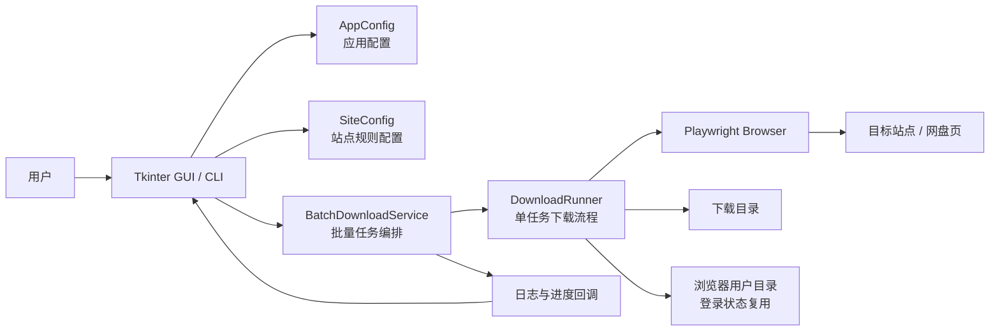
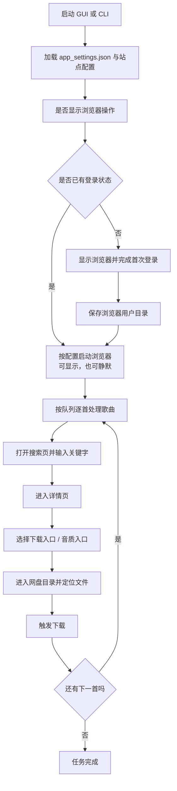

# 可配置网页下载原型

这是一个基于 Python + Playwright 的浏览器自动化下载原型，适合在你有权限访问和下载的站点上做流程自动化。

## 当前能力

1. 打开搜索页并带入关键字。
2. 点击第一条搜索结果。
3. 在详情页查找下载按钮，并按需处理确认弹窗。
4. 点击高品质下载入口，并跟踪新页面或当前页跳转。
5. 进入数字目录。
6. 在文件列表中查找可下载文件，优先选择体积最大的文件下载。
7. 保存浏览器登录状态，避免每次重新登录。

## 环境准备（Windows / macOS）

建议始终使用项目自己的虚拟环境，不要和其他 Python 项目共用环境。

### 先确认这 3 件事

1. 已安装 Python（建议 3.10+），并且终端里能执行 `python` 或 `python3`
2. 已进入项目根目录 `music-downloader`
3. 首次运行时，建议本机已安装 Chrome；Windows 也可以使用 Edge

---

### Windows 配置教程

#### 第 1 步：创建虚拟环境

```powershell
python -m venv .venv
```

#### 第 2 步：激活虚拟环境

```powershell
.\.venv\Scripts\Activate.ps1
```

如果 PowerShell 提示不允许执行脚本，先执行下面这条命令，再重新激活：

```powershell
Set-ExecutionPolicy -Scope Process Bypass
.\.venv\Scripts\Activate.ps1
```

#### 第 3 步：安装项目依赖

```powershell
python -m pip install --upgrade pip
pip install -r requirements.txt
```

#### 第 4 步：安装 Playwright 浏览器内核

```powershell
python -m playwright install chromium
```

#### 第 5 步：准备配置文件

项目自带示例配置文件 `site_config.example.json`。

- 如果你只是先测试程序，可以直接使用这个示例文件
- 如果你要适配自己的站点，建议复制一份再修改，例如复制成 `site_config.json`

Windows 复制示例：

```powershell
Copy-Item .\site_config.example.json .\site_config.json
```

#### 第 6 步：先跑一次测试命令

```powershell
python app.py --query "test file" --config site_config.example.json --download-dir .\downloads
```

#### 第 7 步：退出虚拟环境（用完再执行）

```powershell
deactivate
```

---

### macOS 配置教程

#### 第 1 步：创建虚拟环境

```bash
python3 -m venv .venv
```

#### 第 2 步：激活虚拟环境

```bash
source .venv/bin/activate
```

#### 第 3 步：安装项目依赖

```bash
python -m pip install --upgrade pip
pip install -r requirements.txt
```

#### 第 4 步：安装 Playwright 浏览器内核

```bash
python -m playwright install chromium
```

#### 第 5 步：准备配置文件

项目自带示例配置文件 `site_config.example.json`。

- 如果你只是先测试程序，可以直接使用这个示例文件
- 如果你要适配自己的站点，建议复制一份再修改，例如复制成 `site_config.json`

macOS 复制示例：

```bash
cp ./site_config.example.json ./site_config.json
```

#### 第 6 步：先跑一次测试命令

```bash
python app.py --query "test file" --config site_config.example.json --download-dir ./downloads
```

#### 第 7 步：退出虚拟环境（用完再执行）

```bash
deactivate
```

## 运行方式

### Windows 运行命令

基础运行：

```powershell
.\.venv\Scripts\Activate.ps1
python app.py --query "test file" --config site_config.example.json --download-dir .\downloads
```

无头模式运行：

```powershell
.\.venv\Scripts\Activate.ps1
python app.py --query "test file" --config site_config.example.json --download-dir .\downloads --headless
```

### macOS 运行命令

基础运行：

```bash
source .venv/bin/activate
python app.py --query "test file" --config site_config.example.json --download-dir ./downloads
```

无头模式运行：

```bash
source .venv/bin/activate
python app.py --query "test file" --config site_config.example.json --download-dir ./downloads --headless
```

## 登录状态保持

程序默认会把浏览器用户数据保存到 `.browser-profile`，因此第一次手动登录后，后续运行会复用同一份登录状态。

第一次建议用可视化模式运行并手动登录。

### Windows 首次登录示例

```powershell
.\.venv\Scripts\Activate.ps1
python app.py --query "test file" --browser-channel chrome --no-headless
```

### macOS 首次登录示例

```bash
source .venv/bin/activate
python app.py --query "test file" --browser-channel chrome --no-headless
```

你也可以自定义用户数据目录：

Windows：

```powershell
.\.venv\Scripts\Activate.ps1
python app.py --query "test file" --user-data-dir .\profiles\default
```

macOS：

```bash
source .venv/bin/activate
python app.py --query "test file" --user-data-dir ./profiles/default
```

如果希望使用本机安装的浏览器内核：

Windows：

```powershell
python app.py --query "test file" --browser-channel chrome
python app.py --query "test file" --browser-channel msedge
```

macOS：

```bash
python app.py --query "test file" --browser-channel chrome
```

## 配置说明

建议优先复制 `site_config.example.json` 为你自己的配置文件，再按目标站点实际结构修改。

例如：

- Windows 可以复制成 `site_config.json`
- macOS 也可以复制成 `site_config.json`

对应命令如下：

Windows：

```powershell
Copy-Item .\site_config.example.json .\site_config.json
```

macOS：

```bash
cp ./site_config.example.json ./site_config.json
```

如果你只是先验证程序能否运行，也可以直接使用 `site_config.example.json`。

主要编辑对象就是项目根目录下的 `site_config.example.json`（或你复制出来的 `site_config.json`）。

主要字段含义如下：

- `search_url_template`：搜索页 URL 模板，`{query}` 会自动替换成关键词。
- `search_result_links`：搜索结果第一条的候选选择器。
- `pre_download_confirm_buttons`：进入详情页后、点击下载前，需要先确认的弹窗按钮选择器。
- `detail_download_buttons`：详情页下载按钮选择器。
- `post_download_confirm_buttons`：点击详情页下载按钮后出现的确认弹窗按钮选择器。
- `quality_download_buttons`：高品质下载按钮选择器。
- `post_quality_close_buttons`：进入下一页后，如果有遮挡内容的弹窗，可在这里配置关闭按钮选择器。
- `storage_row_selectors`：文件列表行选择器。
- `row_name_selectors`：每一行里文件名或目录名的选择器。
- `row_size_selectors`：每一行里文件大小的选择器。
- `row_download_selectors`：最终下载按钮选择器。
- `directory_name_pattern`：识别数字目录的正则，默认是 `^\\d+$`。

建议让 `storage_row_selectors` 尽量指向真正的行容器，例如 `tr`、`.ant-table-row`、`.file-row`。如果你选到了更深的子节点，程序也会自动尝试向上归一化到最近的行。

## 日志说明

现在所有运行日志都已经改成中文，常见前缀如下：

- `初始化`：浏览器启动信息。
- `步骤 1/5` 到 `步骤 5/5`：主流程步骤。
- `选择器`：当前正在尝试哪个 selector，是否成功或超时。
- `结果`：搜索结果点击和跳转情况。
- `下载`：详情页下载按钮和高品质按钮处理过程。
- `弹窗`：是否检测到并关闭弹窗。
- `跳转`：点击后是否跳页、是否打开新窗口。
- `目录`：目录层级扫描和进入过程。
- `行`：文件列表行匹配和归一化情况。
- `文本`：文件名、目录名、大小文本的读取过程。
- `文件`：候选文件识别、自动进入文件夹、回退到可下载文件、最大文件选择和最终下载动作。
- `调试`：截图、HTML、调试文本保存位置。
- `错误`：异常类型与完整堆栈。

## 最近的修复

针对“当前页面没有找到可解析大小的可下载文件”这个问题，程序现在增加了这些处理：

- 会先按配置尝试读取大小字段。
- 如果配置的大小列不准，会自动扫描整行单元格，尝试识别像 `12MB`、`1.5GB` 这样的大小文本。
- 如果识别出像“3项”这样的文件夹行，会自动进入下一层。
- 如果进入下一层后仍然读不到大小，但行里存在下载按钮，会回退到“可下载但未知大小”的文件并继续下载。
- 如果最终还是找不到可下载内容，会自动保存截图、HTML 和调试文本。

## 注意事项

- 这个原型只适用于你有权限访问和下载的资源。
- `.venv` 是项目自己的 Python 环境，不建议跨项目复用。
- `.browser-profile` 是项目自己的浏览器状态目录，用来保存登录态。

## 打包成 Windows / macOS 应用

项目现在已经补好了 PyInstaller 打包脚本，默认打成 GUI 应用。

### 1. Windows 打包

推荐按下面顺序执行：

#### 第 1 步：激活虚拟环境

```powershell
.\.venv\Scripts\Activate.ps1
```

#### 第 2 步：执行打包脚本

```powershell
.\build_windows.ps1
```

打包输出目录：

```text
dist/win32/MusicDownloader/
```

主程序一般是：

```text
dist/win32/MusicDownloader/MusicDownloader.exe
```

### 2. macOS 打包

需要在 macOS 机器上执行，不能在 Windows 上直接产出可运行的 `.app`。

推荐按下面顺序执行：

#### 第 1 步：激活虚拟环境

```bash
source .venv/bin/activate
```

#### 第 2 步：执行打包脚本

```bash
bash build_macos.sh
```

如果打包脚本提示缺少 `tkinter`（`_tkinter`），先补齐 Python 的 Tk 支持后再打包。
可先自检：

```bash
python -c "import _tkinter; print('tkinter ok')"
```

若你使用 Homebrew Python 3.13，可安装：

```bash
brew install python-tk@3.13
```

打包输出目录：

```text
dist/darwin/MusicDownloader.app
```

### 3. 可选：打单文件版本

如果你不想输出整个目录，而是想尝试单文件版本，可以执行：

```powershell
.\.venv\Scripts\python.exe build_release.py onefile
```

或在 macOS：

```bash
.venv/bin/python build_release.py onefile
```

### 4. 配置文件和用户数据保存位置

打包后的程序不会把配置写回应用安装目录，而是保存到系统用户目录：

- Windows: `%APPDATA%\MusicDownloader`
- macOS: `~/Library/Application Support/MusicDownloader`

这里会保存：

- `app_settings.json`
- `site_config.json`
- `downloads/`
- `.browser-profile/`

### 5. 浏览器依赖说明

程序默认优先使用本机已安装的 `chrome`，这样更适合打包分发。

如果你想改用 Playwright 自带的 `chromium`，目标机器需要先执行：

```powershell
playwright install chromium
```

如果浏览器启动失败，程序现在会直接提示你切换到 `chrome` / `msedge`，或者安装 `chromium`。

## 浏览器显示配置

图形界面里现在可以直接配置是否显示浏览器操作：

- 首次需要网盘登录时，建议勾选“显示浏览器操作（首次登录建议开启）”
- 登录状态会保存在 `user_data_dir` 指向的浏览器用户目录里
- 后续继续使用同一个用户目录时，可以关闭显示，程序会按后台静默模式运行

## 架构图



## 流程图


